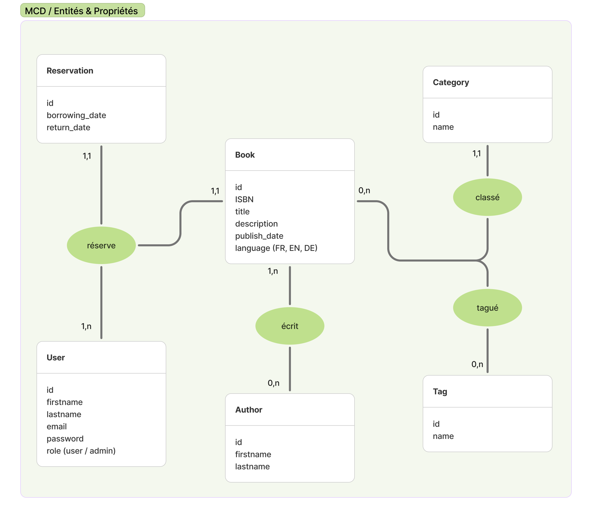

# Biblio Tech


🌼Bienvenue dans notre adorable <mark style="background-color:hsl(79, 42.70%, 60%);color: #1F4746 ;padding: 1px 3px; border-radius: 3px">**bibliothèque**</mark> !🌼

## Table des matières

1. [Équipe](#1-équipe)
2. [Stack technique](#2-stack-technique)
3. [Lancer le projet](#3-lancer-le-projet)
4. [Modèle Conceptuel des Données (MCD)](#4-modèle-conceptuel-des-données-mcd)
5. [Proposition de fonctionnalité](#5-proposition-de-fonctionnalité)
6. [Remarques](#6-remarques)
7. [Références](#7-références)

## 1. Équipe

- 🌻**Frouin Oriane** : [@orinaya](https://www.github.com/orinaya)
- 🌷**Marsaud Marilou** : [@mariloumars](https://github.com/mariloumars)
- 🌼**Norvez Audrey** : [@TaupeInHambourg](https://github.com/TaupeInHambourg)

## 2. Fonctionnalités

Cette application permet de gérer les emprunts de livres dans une bibliothèque.
Voici les principales fonctionnalités :

- <mark style="color:#a9c56d; background-color: transparent ">**Consulter les livres**</mark> : Les utilisateurs authentifiés peuvent voir la liste des livres disponibles, consulter les détails (ISBN, titre, auteur(s), résumé, etc...).
- <mark style="color:#a9c56d; background-color: transparent">**Réservation de livres**</mark> : Les utilisateurs peuvent réserver jusqu’à 5 livres simultanément, mais un livre ne peut être réservé que par une seule personne à la fois.
- <mark style="color:#a9c56d; background-color: transparent">**Gestion des livres pour l’administrateur**</mark> : L’administrateur peut ajouter, éditer ou supprimer des livres.

## 2. Stack technique

| Catégorie  | Technologie                                                                                                     |
| ---------- | --------------------------------------------------------------------------------------------------------------- |
| Langages   |                     |
| Frameworks |         |
| ORM        |  |
| Templating |                  |
| Outils     |                     |

## 3. Lancer le projet

### 3.1 Prérequis

- PHP >= 8.2
- Composer (gestionnaire de dépendances PHP)
- Docker (pour gérer l'environnement de développement)
- Docker Compose (pour la gestion des services Docker)

### 3.2 Installation

📦 Installez les dépendances du projet

```bash
composer install
```

📄 Il vous faudra ensuite créer à la racine du projet un fichier `.env` à partir du fichier `.env.example`

```bash
cp .env.example .env

```

📚 Créez la base de données et appliquez les migrations

```bash
php bin/console doctrine:database:create
php bin/console doctrine:migrations:migrate
```

▶️ Lancez le serveur Symfony

```bash
symfony server:start -d
```

▶️ Lancez les services Docker avec Docker Compose

```bash
docker compose up -d
```

### 3.3 Liens utiles

#### Application

➡️ http://localhost:8000 : Accédez à l'application

#### Adminer

➡️ http://localhost:8080 : **Adminer** permet de gérer facilement la base de données via une interface web. Une fois Docker démarré,vous pouvez donc accéder à Adminer via le lien suivant

**Paramètres de connexion pour Adminer**

```
Système : PostgreSQL
Serveur : database (défini dans .env)
Utilisateur : utilisateur (défini dans .env)
Mot de passe : motdepasse (défini dans .env)
Base de données : nombasededonnées (défini dans .env)
```

### 4. Modèle Conceptuel des Données (MCD)



### 5. Proposition de fonctionnalité

**Système de recommandations personnalisées**

#### Détail de la spécification

Implémentation d'un système de recommandations personnalisées qui suggère aux utilisateurs des livres susceptibles de les intéresser. Les recommandations sont basées sur l'historique d'emprunts de l'utilisateur et les tendances générales de la bibliothèque.

#### Motivation

Cette spécification permet de dynamiser l'application en encourageant les utilisateurs à emprunter des livres, tout en exploitant les données déjà existantes.

#### Nouveaux composants à développer

**Modèle (Entités)**

UserPreference : Stocke les préférences explicites des utilisateurs
Relations avec User, Category, Author
Niveau d'intérêt pour chaque préférence

**Contrôleur**

RecommendationController :

- Méthodes pour générer et afficher les recommandations
- Actions pour les retours utilisateur (feedback, masquer une recommandation)

**Vues**

Dashboard de recommandations : Page principale affichant les suggestions
Widget de recommandation : Composant intégrable dans d'autres pages

"Vous pourriez aussi aimer..." sur la page de détail d'un livre
"Découvertes de la semaine" sur la page d'accueil

### 6. Remarques

### 7. Références
