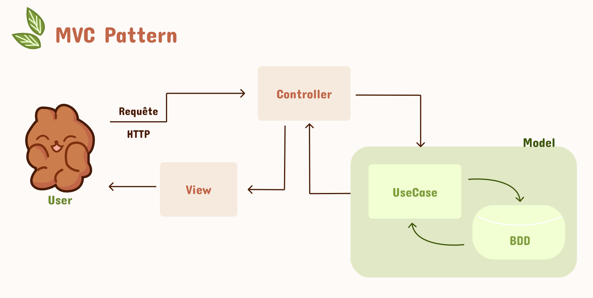

# Veille PHP

## 1. Schéma du pattern MVC. 

## 2. Qu'est ce qu'une session dans le cadre des applications web ?

Dans le cadre des applications web, une session est un lien temporaire entre un utlisateur et le serveur. Cette mécanique permet de crée une persistance malgré le fait que nativement le protocole HTPP est sans état. 

Une session est identifiable par un ID qui est stocké coté serveur et transmis au client via un cookie. 

Une session permet de stocker des informations sur le client, comme un état de connexion ou les préférences utilisateurs. Les sessions sont aussi utile à certaine fonctionnalité web comme le login ou le panier d'achat. 

Cette connexion est temporaire et doit être sécurisé pour éviter tout détournement. 

## 3. Quelles sont les détournement possible des sessions, et comment s'en prémunir. 

### Session Hijacking

Le session hijacking consiste à intercepter l'identifiant de session (session ID) d'un utilisateur légitime, souvent via des réseaux non sécurisés ou des attaques de type "man-in-the-middle".

Une fois le session ID obtenu, l'attaquant peut l'utiliser pour se faire passer pour l'utilisateur auprès du serveur, accédant ainsi aux mêmes ressources et privilèges.

#### Comment s'en protéger ?

 Utiliser des connexions sécurisées (HTTPS), régénérer les identifiants de session après la connexion, et utiliser des cookies sécurisés (HttpOnly, Secure).

### Session Fixation

Le principe est le suivant : le hacker fixe un identifiant de session connu pour l'utilisateur, souvent en incitant l'utilisateur à cliquer sur un lien malveillant contenant cet identifiant.

Ainsi, Lorsque l'utilisateur se connecte avec cet identifiant de session fixé, l'attaquant, connaissant cet identifiant, peut usurper la session.

#### Comment s'en protéger ?

 Régénérer les identifiants de session après des actions sensibles comme la connexion, et ne jamais accepter des identifiants de session provenant de sources non sécurisées.

